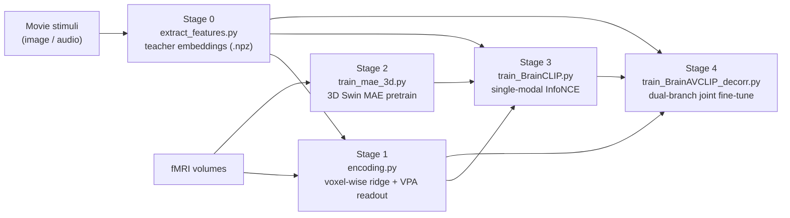

# BrainAV-CLIP

Brain-to-AudioVisual contrastive decoding: decoding audiovisual semantics from fMRI recorded while subjects watched movies. The pipeline pretrains a 3D Swin masked autoencoder (MAE) on brain volumes, aligns the brain encoder to frozen audio/visual teacher embeddings with contrastive learning, and finally jointly fine-tunes independent visual and audio branches for cross-modal retrieval.

## Pipeline overview




## Repository layout

```
BrainAV-CLIP/
  extract_features.py            # Stage 0: extract teacher embeddings from stimuli
  encoding.py                    # Stage 1: voxel-wise encoding + VPA readout (ROI masks)
  train_mae_3d.py                # Stage 2: 3D Swin MAE self-supervised pretraining
  train_BrainCLIP.py             # Stage 3: single-modal brain->stimulus contrastive alignment
  train_BrainAVCLIP_decorr.py    # Stage 4: dual-branch joint fine-tuning
  dataset.py                     # fMRI + stimulus loading / train-val-test splits
  swin3d_transformer.py          # 3D Swin backbone (brain encoder)
  swin3d_mae.py                  # 3D Swin MAE model (Stage 2)
  visualize.py                   # voxel/ROI mask helpers and brain-surface plots
  retrieval_av_analysis/util.py  # AV retrieval evaluation
  fMRI_Narrative_movie/util/     # data loading, ridge, pycortex helpers + config
  requirements.txt
```


## Requirements

```bash
pip install -r requirements.txt
```

- Python 3.9+ and a CUDA-capable GPU are recommended for all training stages.
- `pycortex` is only needed for brain-surface visualization and non-`full` ROI
masks; install it separately if you use those features.
- The teacher extractors in `extract_features.py` pull models from HuggingFace /
LAION. Install only the extras you plan to use (see `requirements.txt`).


### Weights & Biases (wandb)

Training scripts (`train_mae_3d.py`, `train_BrainCLIP.py`,
`train_BrainAVCLIP_decorr.py`) log metrics to [Weights & Biases](https://wandb.ai).

1. **Log in before the first run** (required unless using offline mode):
  ```bash
   wandb login
  ```
   Paste your API key from [https://wandb.ai/authorize](https://wandb.ai/authorize) when prompted. Do not
   commit API keys into the repository.
2. **Set your entity (username or team)**. Each training script defines:
  ```python
   WANDB_ENTITY = os.getenv("WANDB_ENTITY", "YOUR_WANDB_ENTITY")
   WANDB_PROJECT = os.getenv("WANDB_PROJECT", "...")
  ```
   Either export the environment variable:
   or replace `YOUR_WANDB_ENTITY` in the script with your wandb username/team.
3. **Offline / no account**: skip cloud upload with:
  ```bash
   export WANDB_MODE=offline
  ```
   Runs still write local logs under the run directory; `wandb login` is not required.


## Data preparation

All hard-coded paths in this repo are replaced with the placeholder `PATH/TO/...`.
Edit them to point to your data before running. The main entry points are:

- `dataset.py`: `feat_path` default (`PATH/TO/Narrative_Movie_fMRI_Dataset/derivatives/feat`)
- `encoding.py` / `train_BrainCLIP.py` / `train_BrainAVCLIP.py`: the `FEAT_PATH` constant near the top
- `fMRI_Narrative_movie/util/config__drama_data.yaml`: `dir.derivative`

Expected dataset structure (derived from the config and loaders):

```
PATH/TO/Narrative_Movie_fMRI_Dataset/
  stimuli/
    img/<Movie_Name>/*.jpg           # frames
    wav/<Movie_Name>/*.wav           # audio clips
  derivatives/
    feat/<Category>/<feat_name>/<Movie_Name>.npz   # extracted teacher features
    preprocessed_data/               # fMRI responses + cortical masks
    ...
```

The dataset uses 7 "seen" movies (train/val/test split) plus 1 unseen movie
(Glee) for generalization tests, matching the loaders in `dataset.py`.

## Stage 0 - Teacher feature extraction

`extract_features.py` extracts visual and audio embeddings for each movie with a
chosen teacher model (CLIP, SigLIP, BLIP, DINOv3, CLAP, AST, PANNs, etc.)
and saves them as `.npz` under `derivatives/feat/<Category>/<feat_name>/`.

1. Set the paths in the `CONFIG` block at the top of the file
  (`DATA_ROOT`, `OUTPUT_ROOT`, `MODEL_CACHE_ROOT`).
2. Uncomment/register the extractors you want in `main()`.
3. Run:

```bash
python extract_features.py
```


## Stage 1 - Encoding readout (voxel-wise ridge + VPA)

`encoding.py` runs traditional voxel-wise ridge encoding on the extracted teacher features to quantify how well each visual/audio representation explains fMRI responses per voxel. The variance partitioning analysis (VPA) then decomposes joint visual–audio encoding into visual-unique, audio-unique, and shared components, and exports ROI readout masks (e.g. `ROI_V`, `ROI_A`) used
in later training via `--roi` / `--visual_roi` / `--audio_roi`.

Edit `if __name__ == '__main__'` and run:

```bash
python encoding.py
```

Set `FEAT_PATH` at the top of `encoding.py` to your feature directory before
running. Outputs are written under `./encoding/`.

## Stage 2 - 3D Swin MAE pretraining

Self-supervised masked reconstruction of brain volumes (mask ratio 0.5). The
subject, epoch count and batch size are set inside `train_mae()`
(`subject_name`, `epoch_num=200`, `batch_size=64`).

```bash
python train_mae_3d.py
```

The resulting checkpoint (`.../MAE/<subject>_Swin3DMAE_Mask50_voxel_pcc/checkpoints/last.ckpt`)
is used to warm-start Stage 3.

## Stage 3 - Single-modal contrastive alignment

Aligns the brain encoder to a frozen teacher feature via InfoNCE. Train one
model per modality (a visual `feat_name` and an audio `feat_name`).

Visual example:

```bash
python train_BrainCLIP.py \
  --subject_name S01 \
  --feat_type Visual_Model \
  --feat_name clip_base_img \
  --output_dim 512 \
  --roi ROI_V
```

Audio example:

```bash
python train_BrainCLIP.py \
  --subject_name S01 \
  --feat_type Audio_Model \
  --feat_name clap_audio \
  --output_dim 512 \
  --roi ROI_A
```

or use `--run_single_modal_grid_once_fmri`

```bash
python train_BrainCLIP.py \
  --run_single_modal_grid_once_fmri \
  --roi "ROI_V" \
  --run_modality "V" \
  --subject_name S01
```

```bash
python train_BrainCLIP.py \
  --run_single_modal_grid_once_fmri \
  --roi "ROI_A" \
  --run_modality "A" \
  --subject_name S01
```

Key arguments: `--roi` (`full`, `LVC`, `HVC`, `AC`, or VPA-derived keys such as
`ROI_V`/`ROI_A` from Stage 1). To point at a Stage 2
checkpoint, set `pretrained_mae_path` inside `train_brain_clip()`.

## Stage 4 - Dual-branch joint fine-tuning

Independent visual and audio Swin encoders, warm-started from the Stage 3
single-modal checkpoints, jointly fine-tuned with **Cross-Modal Hard Negative InfoNCE (CMHN-InfoNCE)**.

```bash
python train_BrainAVCLIP_decorr.py \
  --subject_name S01 \
  --visual_feat_name clip_base_img \
  --audio_feat_name clap_audio \
  --visual_roi ROI_V \
  --audio_roi ROI_A \
  --epoch_num 10
```

or use `--run_grid`

```bash
python train_BrainAVCLIP_decorr.py \
  --run_grid \
  --subject_name S01 \
  --co_error_gamma_v 2.0 \
  --co_error_gamma_a 10.0 
```

Useful flags: `--visual_roi` / `--audio_roi` (often `ROI_V` + `ROI_A` from  
Stage 1), `--no_decorr`, `--co_error_gamma_v` / `--co_error_gamma_a`,  
`--freeze_visual` / `--freeze_audio`, and `--run_grid` for batch runs. The MAE  
checkpoint directory is set via the `pretrained_mae_path` block.

## Notes

- Experiment logging uses Weights & Biases; see [Weights & Biases (wandb)](#weights--biases-wandb) above for login and entity setup.

